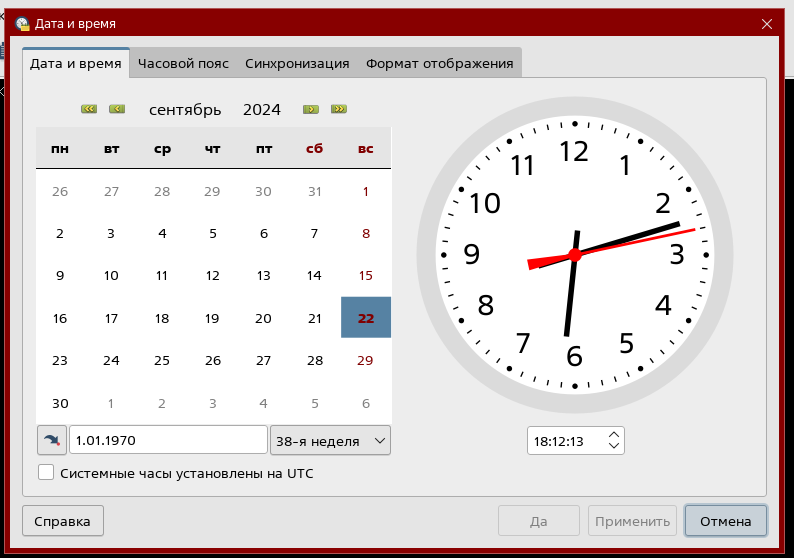
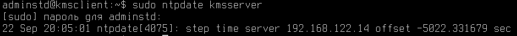

# ЛР1 Основы сетевого администрирования

## Задание 1

### 2.1.1. Проанализируйте файл `/etc/network/interfaces`. Что означает каждая строка?

`source /etc/network/interfaces.d/*` - подключение папки со всем ее содержимым

`auto lo` - автоматически при загрузке системы подключить виртуальный сетевой интерфейс. Любой трафик, который посылается программой на интерфейс loopback, тут же получается тем же интерфейсом.

`iface lo inet loopback` - настройка интерфейса lo с протоколом ipv4(за ipv4 отвечает inet)

`auto eth0` - автоматически включать интерфейс eth0 при старте

`iface eth0 inet dhcp` - присвоение ip адреса при подключении к dhcp серверу

### 2.1.2. Выясните текущие сетевые настройки каждой машины. Проверьте соединение между клиентом и сервером

`sudo ifconfig`

`ping`

### 2.1.3. Используя параметры, приведённые в таблице ниже, настройте сеть, дополнив необходимые конфигурационные файлы

|Machine name        | Server         | Client         |
|-                   |:-:             |:-:             |
|**Host name**       | kmsserver      | kmsclient      |
|**IP address**      | 192.168.122.14 | 192.168.122.15 |
|**Default gateway** |         192.168.122.1           |

`sudo nano /etc/hostname` - меняем имя пользователя и перезапускаем

`sudo nano /etc/network/interfaces`


Перезагружаем интерфейс

`sudo ifdown eth0`

`sudo ifup eth0`

В файле `/etc/hosts` нужно указать сопоставление ip адреса и доменного имени, чтобы ping знал по какому адресу стучаться если используем доменное имя для подключения. И на клиенте и на сервере.


*/etc/hosts:*

```bash
127.0.0.1       localhost
127.0.1.1       ru01std00v
192.168.122.14  kmsserver
192.168.122.15  kmsclient
...
```

## Задание 2

### 2.2.1. На сервере создайте локальный FTP-репозиторий и загрузите на него файл, содержащий в названии ваши ФИО

`sudo apt install vsftpd`

В конфигурационном файле `/etc/vsftpd.conf` нужно изменить
настройки для использования ipv4 вместо ipv6 и разрешить использование анонимного доступа. Это нужно, чтобы можно было работать с репозиторием.

`listen=YES`

`listen_ipv6=NO`

`anonymous_enable=YES`

Перезапускаем службу

`systemctl restart vsftpd`

На клиенте:

`nano fio.txt`

`sftp adminstd@kmsserver`

<details>
  <summary>Загрузка файла с локальной машины на удаленный сервер:</summary>

```bash
put /local/path/to/file /remote/path/to/file
```

</details>

`put /home/adminstd/fio.txt /home/adminstd/fio.txt`

### 2.2.2. Выгрузите файл из созданного репозитория на машину Client

На клиенте:

`exit`

`rm fio.txt`

`sftp adminstd@kmsserver`

<details>
  <summary>Скачивание файла с удаленного сервера на локальную машину:</summary>

```bash
get /remote/path/to/file /local/path/to/file
```

</details>

`get /home/adminstd/fio.txt ./fio.txt`

### 2.2.3. Создайте на сервере общую папку smb и примонтируйте её на машине клиента в директорию с вашим именем

`sudo apt install samba`

`sudo mkdir /serv /serv/share`

`sudo chown nobody:nogroup /serv/share`

`sudo chmod 775 /serv/share`

`sudo nano /etc/samba/smb.conf`

*/etc/samba/smb.conf:*
```bash
map to guest = Bad User
[share]
    comment = test123
    guest ok = yes
    force user = nobody
    force group = nogroup
    path = /serv/share
    read only = no
```

`testparm`

`sudo systemctl restart smbd`

`sudo apt install cifs-utils`

На клиенте:

`sudo mount -t cifs //kmsserver/share ~ -o users,sec=none`

- `-t` - использовать тип файлововй системы cifs
- `//kmsserver/share` - папка на сервере
- `~` - указываем, что монтируем к homedir
- `-o` - для указания опций
- `users` - указываем, что папка будет использоваться для всех пользователей
- `sec` - отвечает за безопасность

### 2.2.4. На Client, используя графический интерфейс, поменяйте дату и время на 01.01.1970 и 18:12. Синхронизируйте время Server и Client по сети, установив NTP-сервер на машину Server



На сервере:

`sudo apt install ntp`

На всякий пожарный сделаем копию конфигурационного файла для ntp

`sudo cp /etc/ntp.conf /etc/ntp.conf.orig`

`sudo rm /etc/ntp.conf`

`sudo nano /etc/ntp.conf`


*etc/ntp.conf:*

```bash
server 127.127.1.0 prefer
```

- server - указывает, к какому серверу необходмо подключиться для получения точного времени.
- 127.127.1.0 - адрес, по которому сервер получает своё системное время, которое будет отправляться по запросу клиенту
- prefer - указывается обязательно, так как серверу не нравится факт использования своего времени из-за высокой вероятности рассинхронизации с точным мировым временем

`sudo systemctl restart ntp`

На клиенте:

`sudo ntpdate kmsserver` - должно после этого обновиться время



## Задание 3

### 2.3.1. На сервере запустите службу ssh и добавьте её в автозагрузку

`sudo apt install ssh`

`sudo systemctl enable ssh` - добавили в автозагрузку

`status sshd.service` - можно проверить добавлось ли

### 2.3.2. На клиенте настройте аутентификацию по ключам с сервером

На сервере:

`ssh-keygen` - генерируем ключи

`ssh-copy-id adminstd@kmsclient` - закидываем ключ клиенту

На клиенте:

`ssh adminstd@kmsserver` - подключаемся к серверу

### 2.3.3. Подключитесь к серверу с машины клиента и создайте в директории /home/study файл с содержимым «Hello world!»

`ssh adminstd@kmsserver` - подключаемся к серверу

`mkdir ~/study`

`nano ~/study/file.txt`

### 2.3.4. Скопируйте с сервера на клиент (командой scp) файл, созданный в предыдущем пункте

`sudo scp adminstd@kmsserver:~/study/file.txt /home`

## Контрольные вопросы

### 1. Что такое ЛВС? Из каких устройств может состоять?

**Локальная вычислтьельная сеть** - компьютерная сеть, покрывающая как правило относительно небольшую территорию или небольшую группу зданий (офис, дом, фирма, институт)

Она может состоять из разлиных вычислительных устройств - компьютеров, серверов, маршрутизаторов, принтеров и тд.

### 2. Из каких уровней состоит модель OSI? Для чего её создали?

1. Физический уровень (кабели, разъемы)
2. Канальный уровень (MAC-адреса, Ethernet, коммутаторы, мосты, кадры)
3. Сетевой уровень (IP-адресация, маршрутизаци)

#### 1. Физический уровень (Physical Layer)

- **Описание**: Определяет электрические и физические параметры устройства. Отвечает за передачу битов по физической среде (кабели, радиоволны и т.д.).
- **Примеры**: Кабели, разъемы, физические топологии, параметры сигналов, повторители, концентраторы.

#### 2. Канальный уровень (Data Link Layer)
- **Описание**: Обеспечивает надежную передачу данных между соседними узлами, устраняя ошибки, возникающие на физическом уровне. Управляет доступом к среде передачи.
- **Примеры**: MAC-адреса, Ethernet, PPP, коммутаторы, мосты, кадры (frames).

#### 3. Сетевой уровень (Network Layer)
- **Описание**: Отвечает за определение пути и маршрутизацию данных между узлами в различных сетях. Определяет, каким образом данные будут передаваться от отправителя к получателю.
- **Примеры**: IP-адресация, маршрутизация, IP-протокол, маршрутизаторы, ICMP, OSPF.

#### 4. Транспортный уровень (Transport Layer)
- **Описание**: Обеспечивает доставку данных от одного узла к другому с необходимым уровнем надежности. Отвечает за сегментацию, управление потоком и исправление ошибок.
- **Примеры**: TCP, UDP, порты, сегменты, управление перегрузкой, подтверждение передачи.

#### 5. Сеансовый уровень (Session Layer)
- **Описание**: Управляет установлением, поддержанием и завершением сеансов связи между приложениями. Поддерживает синхронизацию и контроль диалога.
- **Примеры**: Управление сессиями, RPC (Remote Procedure Call), точки восстановления (checkpoints).

#### 6. Уровень представления (Presentation Layer)
- **Описание**: Обеспечивает преобразование данных в формат, понятный для приложения. Отвечает за кодирование, шифрование и сжатие данных.
- **Примеры**: Форматы данных (JPEG, MPEG, ASCII), SSL/TLS, шифрование, преобразование протоколов.

#### 7. Прикладной уровень (Application Layer)
- **Описание**: Предоставляет интерфейсы и протоколы для взаимодействия с пользователями. Определяет способы доступа к сетевым ресурсам и приложениям.
- **Примеры**: HTTP, FTP, SMTP, DNS, POP3, приложения и сервисы, такие как веб-браузеры и почтовые клиенты.


### 3. Какие операционные системы могут использоваться на серверах?

Различные.

Windows Server, Linux, Unix-подобные (FreeBSD, OpenBSD, Solaris), macOS Server

### 4. Что такое виртуальная машина? Зачем она нужна?

Виртуальная машина - программная или аппаратная схема, эмулирующая аппаратное обеспечекние компьютера и исполняющая программы для guest-платформы на host-платформе

### 5. Какие существуют способы передачи файлов по сети?

FTP (в основном в глобальной сети), SMB (в основном в локальной сети), SSH