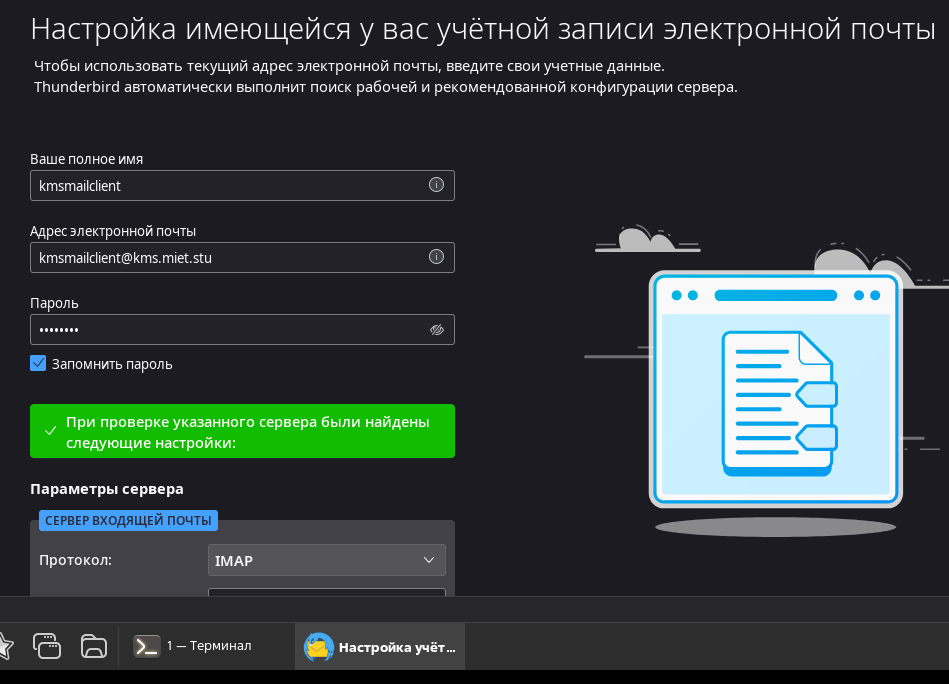
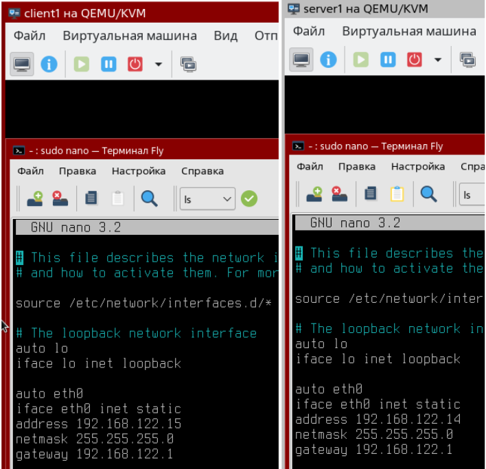
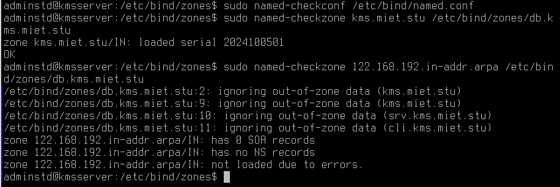
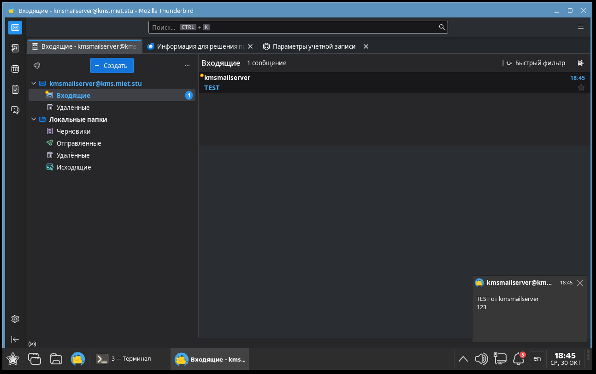

# ЛР1 Основы сетевого администрирования

## Задание 1

### 2.1.1. Проанализируйте файл `/etc/network/interfaces`. Что означает каждая строка?

`source /etc/network/interfaces.d/*` - подключение папки со всем ее содержимым

`auto lo` - автоматически при загрузке системы подключить виртуальный сетевой интерфейс. Любой трафик, который посылается программой на интерфейс loopback, тут же получается тем же интерфейсом.

`iface lo inet loopback` - настройка интерфейса lo с протоколом ipv4(за ipv4 отвечает inet)

`auto eth0` - автоматически включать интерфейс eth0 при старте

`iface eth0 inet dhcp` - присвоение ip адреса при подключении к dhcp серверу

### 2.1.2. Выясните текущие сетевые настройки каждой машины. Проверьте соединение между клиентом и сервером

`sudo ifconfig`

`ping`

### 2.1.3. Используя параметры, приведённые в таблице ниже, настройте сеть, дополнив необходимые конфигурационные файлы



`sudo nano /etc/hostname` - меняем имя пользователя и перезапускаем

`sudo nano /etc/network/interfaces`



Перезагружаем интерфейс

`sudo ifdown eth0`

`sudo ifup eth0`

В файле `/etc/hosts` нужно указать сопоставление ip адреса и доменного имени, чтобы ping знал по какому адресу стучаться если используем доменное имя для подключения. И на клиенте и на сервере.



## Задание 2

### 2.2.1. На сервере создайте локальный FTP-репозиторий и загрузите на него файл, содержащий в названии ваши ФИО

`sudo apt install vsftpd`

В конфигурационном файле `/etc/vsftpd.conf` нужно изменить
настройки для использования ipv4 вместо ipv6 и разрешить использование анонимного доступа. Это нужно, чтобы можно было работать с репозиторием.

`listen=YES`

`listen_ipv6=NO`

`anonymous_enable=YES`

Перезапускаем службу

`systemctl restart vsftpd`

На клиенте:

`nano fio.txt`

`sftp adminstd@kmsserver`

<details>
  <summary>Загрузка файла с локальной машины на удаленный сервер:</summary>

```bash
put /local/path/to/file /remote/path/to/file
```

</details>

`put /home/adminstd/fio.txt /home/adminstd/fio.txt`

### 2.2.2. Выгрузите файл из созданного репозитория на машину Client

На клиенте:

`exit`

`rm fio.txt`

`sftp adminstd@kmsserver`

<details>
  <summary>Скачивание файла с удаленного сервера на локальную машину:</summary>

```bash
get /remote/path/to/file /local/path/to/file
```

</details>

`get /home/adminstd/fio.txt ./fio.txt`

### 2.2.3. Создайте на сервере общую папку smb и примонтируйте её на машине клиента в директорию с вашим именем

`sudo apt install samba`

`sudo mkdir /serv /serv/share`

`sudo chown nobody:nogroup /serv/share`

`sudo chmod 775 /serv/share`

`sudo nano /etc/samba/smb.conf`



`testparm`

`sudo systemctl restart smbd`

`sudo apt install cifs-utils`

На клиенте:

`sudo mount -t cifs //kmsserver/share ~ -o users,sec=none`

- `-t` - использовать тип файлововй системы cifs
- `//kmsserver/share` - папка на сервере
- `~` - указываем, что монтируем к homedir
- `-o` - для указания опций
- `users` - указываем, что папка будет использоваться для всех пользователей
- `sec` - отвечает за безопасность

### 2.2.4. На Client, используя графический интерфейс, поменяйте дату и время на 01.01.1970 и 18:12. Синхронизируйте время Server и Client по сети, установив NTP-сервер на машину Server

