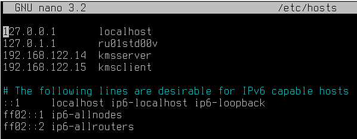

# Лабораторная работа №3 "Веб-сервер. межсетевой экран и прокси-сервер"

## Задание 1

### Выполните в терминале HTTP-запрос станицы с информацие про сеть TCP/IP, лежащего по адресу lib.ru/unixhelp/network.txt. HTTP-ответ сохраните в домашней директории под именем network.html

adminstd@kmsclient:~$ `sudo apt install netcat`

adminstd@kmsclient:~$ `echo -e "GET http://lib.ru/unixhelp/network.txt HTTP/1.0\n\n" | nc lib.ru 80 | iconv -f koi8-r -t UTF-8 > network.html`

`HTTP/1.0` - указание версии протокола

`nc` приводит к созданию TCP-подключения с указанными реквизитами и 
замыканием стандартного ввода на сетевой вывод и наоборот, стандартного 
вывода на сетевой ввод. Такая функциональность напоминает команду cat

`iconv -f koi8-r -t UTF-8` - для указания кодировки

### Откройте с помощью браузера файл network.html и убедитесь, что текст правильно отформатирован.

adminstd@kmsclient ~ $ `firefox network.html`

## Задание 2

### Создайте в директории /var/www/site/ HTML-документ

adminstd@kmsserver ~ $ `sudo mkdir -p /var/www/site`

adminstd@kmsserver ~ $ `sudo touch /var/www/site/mydoc.html`

<details><summary>тык</summary>

```html
<!DOCTYPE html>
<html lang="en">
<head>
  <meta charset="UTF-8">
  <meta name="viewport" content="width=device-width, initial-scale=1.0">
  <title>Document</title>
</head>
<body>
  HELLO
</body>
</html>
```
</details>


### Установите веб-сервер Nginx и настройте его работу так, чтобы он при HTTP-запросе выдавал созданный вами HTML-документ

Включить extended репозиторий астры, если не включен

adminstd@kmsclient ~ $ `sudo apt install nginx`

adminstd@kmsclient ~ $ `sudo systemctl enable nginx`

Сделаем backup конфигурационного файла:

adminstd@kmsserver /etc/nginx/sites-enabled $ `sudo mv /etc/nginx/nginx.conf /etc/nginx/nginx.conf.orig`

adminstd@kmsserver /etc/nginx/sites-enabled $ `sn /etc/nginx/nginx.conf`

`/etc/nginx/nginx.conf`

<details><summary>тык</summary>

```bash
user www-data;
worker_processes auto;
pid /run/nginx.pid;

events {
        worker_connections 10;
}
http {
        sendfile on;
        tcp_nopush on;
        tcp_nodelay on;
        keepalive_timeout 60;

        access_log /var/www/site/access.log;
        error_log /var/www/site/error.log;
server {
        listen 80 default_server;
        root /var/www/site;
        index mydoc.html;
        server_name site.kms.miet.stu;
}
}
```
</details>


adminstd@kmsserver /etc/nginx/sites-enabled $ `sudo nginx -t`

adminstd@kmsserver /etc/nginx/sites-enabled $ `sudo systemctl restart nginx`

adminstd@kmsserver ~ $ `firefox /var/www/site/mydoc.html`


### Добавьте созданную страницу в список записей DNS и откройте её с машины клиента, используя доменное имя site."Ваши инициалы".miet.stu

adminstd@kmsserver ~ $ `sn /etc/resolv.conf`

<details><summary>тык</summary>

  ```bash
  nameserver 192.168.122.13
  domain kms.miet.stu

  nameserver 8.8.8.8
```
</details>

adminstd@kmsclient ~ $ `sn /etc/resolv.conf`

<details><summary>тык</summary>

```bash
nameserver 192.168.122.13
domain     kms.miet.stu
```
</details>

adminstd@kmsserver ~ $ `sn /etc/bind/named.conf.local` 

<details><summary>тык</summary>

```bash
zone "kms.miet.stu" {
        type master;
        file "/etc/bind/zones/db.kms.miet.stu";
};

zone "122.168.192.in-addr.arpa" {
        type master;
        file "/etc/bind/zones/192.168.122";
};
```
</details>

adminstd@kmsserver ~ $ `sn /etc/bind/zones/db.kms.miet.stu` 

<details><summary>тык</summary>

```bash
$TTL 604800
kms.miet.stu.   IN      SOA srv.kms.miet.stu. karpukhin235@gmail.com (
                                2024100501
                                3h
                                1h
                                1w
                                1h
                        )
kms.miet.stu.           IN      NS      srv.kms.miet.stu.
srv.kms.miet.stu.       IN      A       192.168.122.13
cli1.kms.miet.stu.      IN      A       192.168.122.14
cli2.kms.miet.stu.      IN      A       192.168.122.15
site.kms.miet.stu.      IN      A       192.168.122.13


server                  IN      CNAME   srv.kms.miet.stu.
client1                 IN      CNAME   cli1.kms.miet.stu.
client2                 IN      CNAME   cli2.kms.miet.stu.
website                 IN      CNAME   site.kms.miet.stu.
```
</details>

adminstd@kmsserver ~ $ `sn /etc/bind/zones/192.168.122` 

<details><summary>тык</summary>

```bash
$TTL 604800
122.168.192.in-addr.arpa.       IN      SOA srv.kms.miet.stu. karpukhin235@gmail.com (
                                        2024100501
                                        3h
                                        1h
                                        1w
                                        1h
                                        ) 
122.168.192.in-addr.arpa.       IN      NS srv.kms.miet.stu.

13                              IN      PTR srv.kms.miet.stu.
14                              IN      PTR cli1.kms.miet.stu.
15                              IN      PTR cli2.kms.miet.stu.
13                              IN      PTR site.kms.miet.stu.
```
</details>

На всякий пожарный вот проверки

adminstd@kmsserver ~ $ `sudo named-checkconf /etc/bind/named.conf`

adminstd@kmsserver ~ $ `sudo named-checkzone kms.miet.stu /etc/bind/zones/db.kms.miet.stu`

adminstd@kmsserver ~ $ `sudo named-checkzone 122.168.192.in-addr.arpa /etc/bind/zones/192.168.122`

adminstd@kmsclient ~ $ `ping server`

adminstd@kmsclient ~ $ `ping cli1`

adminstd@kmsserver ~ $ `ping server`

adminstd@kmsserver ~ $ `ping cli1`

Проверяем можем ли зайти на сайт (по идее должны)

adminstd@kmsserver ~ $ `firefox website`

adminstd@kmsclient ~ $ `firefox website`


## Задание 3

### Включите встроенный межсетевой экран на сервере и выполните сброс текущего состояния

adminstd@kmsserver ~ $ `sudo ufw enable`

adminstd@kmsserver ~ $ `sudo ufw reset`

adminstd@kmsserver ~ $ `sudo ufw status` - восстановить правила и состояние "по умолчанию". Так как "по умолчанию" сервис выключен, после этой команды его нужно включить: ufw enable

adminstd@kmsserver ~ $ `sudo ufw enable`

### Добавьте правило, запрещающее подключение к серверу по протоколу sftp (порт 22)

Если выключить ufw и проверить можно ли подключиться через sftp то по идее должно подключаться

Когда включим ufw и пропишем это 

adminstd@kmsserver ~ $ `sudo ufw deny 22/tcp`

Но у меня почему-то как только включили ufw (без прописывания `sudo ufw deny 22/tcp`), так сразу sftp перестает работать. По идее так не должно работать, но я хз почему так


### Добавьте правило, разрешающее все входящие пакеты от клиента

adminstd@kmsserver ~ $ `sudo ufw allow from 192.168.122.14`

adminstd@kmsserver ~ $ `sudo ufw allow 22/tcp`

adminstd@kmsserver ~ $ `sudo ufw status`

```bash
Status: active

To                         Action      From
--                         ------      ----
22/tcp                     ALLOW       Anywhere                  
Anywhere                   ALLOW       192.168.122.14            
22/tcp (v6)                ALLOW       Anywhere (v6)   
```

### Проверье подключение к серверу по протоколам sftp и ftp.

По sftp: `sftp adminstd@pdvserver`

По ftp: `ftp pdvserver`

### Удалите правило (не используя reset), запрещающее работу sftp, проверьте подключениею

adminstd@kmsserver ~ $ `sudo ufw deny 22/tcp`

adminstd@kmsserver ~ $ `sudo ufw status numbered`

```bash
Status: active

     To                         Action      From
     --                         ------      ----
[ 1] 22/tcp                     DENY IN     Anywhere                  
[ 2] Anywhere                   ALLOW IN    192.168.122.14            
[ 3] 21/tcp                     ALLOW IN    Anywhere                  
[ 4] 22/tcp (v6)                DENY IN     Anywhere (v6)             
[ 5] 21/tcp (v6)                ALLOW IN    Anywhere (v6)   
```

adminstd@kmsserver ~ $ `sudo ufw delete 1`
```bash
Deleting:
 deny 22/tcp
Proceed with operation (y|n)? y
Rule deleted
```

adminstd@kmsserver ~ $ `sudo ufw status numbered`

```bash
Status: active

     To                         Action      From
     --                         ------      ----
[ 1] Anywhere                   ALLOW IN    192.168.122.14            
[ 2] 21/tcp                     ALLOW IN    Anywhere                  
[ 3] 22/tcp (v6)                DENY IN     Anywhere (v6)             
[ 4] 21/tcp (v6)                ALLOW IN    Anywhere (v6)  
```

adminstd@kmsserver ~ $ `sudo ufw delete 3`

```bash
Deleting:
 deny 22/tcp
Proceed with operation (y|n)? y
Rule deleted (v6)
```

adminstd@kmsserver ~ $ `sudo ufw status numbered`

```bash
Status: active

     To                         Action      From
     --                         ------      ----
[ 1] Anywhere                   ALLOW IN    192.168.122.14            
[ 2] 21/tcp                     ALLOW IN    Anywhere                  
[ 3] 21/tcp (v6)                ALLOW IN    Anywhere (v6)  
```

### Выключите межсетевой экран

adminstd@kmsserver ~ $ `sudo ufw disable`

adminstd@kmsserver ~ $ `stl stop ufw`

## Задание 4

### Установите Squid на сервер

adminstd@kmsserver ~ $ `sudo apt install squid`

adminstd@kmsserver ~ $ `stl status squid`

adminstd@kmsserver ~ $ `stl enable squid`

adminstd@kmsserver ~ $ `stl start squid`

adminstd@kmsserver ~ $ `stl status squid`

adminstd@kmsserver ~ $ `sudo mv /etc/squid/squid.conf /etc/squid/squid.conf.backup` - на всякий пожарный

adminstd@kmsserver ~ $ `sudo sed -i '/^#/d;/^$/d' /etc/squid/squid.conf` - это чтобы удалить все комментарии из файла (для удобства)

### Настройте прокси-сервер таким образов, чтобы был ограничен доступ к сайту vk.com в рабочее время, а остальные сайты запускались свободно

adminstd@kmsserver ~ $ `sn /etc/squid/block.txt` 
```bash
.vk.com
```

дописать что добавили строки в adminstd@kmsserver ~ $ `sn /etc/squid/squid.conf`

<details><summary>тык</summary>

```bash
#http_port 3128

acl localnet src 0.0.0.1-0.255.255.255  # RFC 1122 "this" network (LAN)
acl localnet src 10.0.0.0/8             # RFC 1918 local private network (LAN)
acl localnet src 100.64.0.0/10          # RFC 6598 shared address space (CGN)
acl localnet src 169.254.0.0/16         # RFC 3927 link-local (directly plugged) machines
acl localnet src 172.16.0.0/12          # RFC 1918 local private network (LAN)
acl localnet src 192.168.0.0/16         # RFC 1918 local private network (LAN)
acl localnet src fc00::/7               # RFC 4193 local private network range
acl localnet src fe80::/10              # RFC 4291 link-local (directly plugged) machines
acl localnet src 192.168.122.0/24
acl SSL_ports port 443
acl Safe_ports port 80          # http
acl Safe_ports port 21          # ftp
acl Safe_ports port 443         # https
acl Safe_ports port 70          # gopher
acl Safe_ports port 210         # wais
acl Safe_ports port 1025-65535  # unregistered ports
acl Safe_ports port 280         # http-mgmt
acl Safe_ports port 488         # gss-http
acl Safe_ports port 591         # filemaker
acl Safe_ports port 777         # multiling http
http_access deny !Safe_ports
http_access deny CONNECT !SSL_ports
http_access allow localhost manager
http_access deny manager
include /etc/squid/conf.d/*.conf

acl block-site dstdomain "/etc/squid/block.txt"
acl work_hours time MTWHF 09:00-18:00
http_access deny block-site work_hours


http_access allow localnet
http_access deny all
http_port 3128
coredump_dir /var/spool/squid
refresh_pattern ^ftp:           1440    20%     10080
refresh_pattern ^gopher:        1440    0%      1440
refresh_pattern -i (/cgi-bin/|\?) 0     0%      0
refresh_pattern .               0       20%     4320
```
</details>

дописать adminstd@kmsserver ~ $ `sn /etc/squid/squid.conf`
Обратить внимание на localnet и localhost в http_access allow localnet (типо по умолчанию там localhost)

`acl work_hours time MTWHF 09:00-18:00` - вот эта строчка блокирует в рабочее время

adminstd@kmsserver ~ $ `sudo squid -k reconfigure`



### Убедитесь, что из-под клиента имеется доступ к созданному вами сайту. Запретите клиенту подключение к сайту с помощью прокси-сервера

На клиенте в браузере тоже прописать прокси сервер

adminstd@kmsclient ~ $ ``firefox website``

Запрещаем доступ добавлением нового блоклиста

adminstd@kmsserver ~ $ `sn /etc/squid/block_mysite.txt`

```bash
.website
```

adminstd@kmsserver ~ $ `sn /etc/squid/squid.conf`

<details><summary>тык</summary>

```bash
#http_port 3128

acl localnet src 0.0.0.1-0.255.255.255  # RFC 1122 "this" network (LAN)
acl localnet src 10.0.0.0/8             # RFC 1918 local private network (LAN)
acl localnet src 100.64.0.0/10          # RFC 6598 shared address space (CGN)
acl localnet src 169.254.0.0/16         # RFC 3927 link-local (directly plugged) machines
acl localnet src 172.16.0.0/12          # RFC 1918 local private network (LAN)
acl localnet src 192.168.0.0/16         # RFC 1918 local private network (LAN)
acl localnet src fc00::/7               # RFC 4193 local private network range
acl localnet src fe80::/10              # RFC 4291 link-local (directly plugged) machines
acl localnet src 192.168.122.0/24
acl SSL_ports port 443
acl Safe_ports port 80          # http
acl Safe_ports port 21          # ftp
acl Safe_ports port 443         # https
acl Safe_ports port 70          # gopher
acl Safe_ports port 210         # wais
acl Safe_ports port 1025-65535  # unregistered ports
acl Safe_ports port 280         # http-mgmt
acl Safe_ports port 488         # gss-http
acl Safe_ports port 591         # filemaker
acl Safe_ports port 777         # multiling http
http_access deny !Safe_ports
http_access deny CONNECT !SSL_ports
http_access allow localhost manager
http_access deny manager
include /etc/squid/conf.d/*.conf

acl block-site1 dstdomain "/etc/squid/block.txt"
acl block-site2 dstdomain "/etc/squid/block_mysite.txt"

acl work_hours time MTWHF 09:00-18:00
http_access deny block-site1 work_hours
http_access deny block-site2


http_access allow localnet
http_access deny all
http_port 3128
coredump_dir /var/spool/squid
refresh_pattern ^ftp:           1440    20%     10080
refresh_pattern ^gopher:        1440    0%      1440
refresh_pattern -i (/cgi-bin/|\?) 0     0%      0
refresh_pattern .               0       20%     4320
```

</details>

*P.S. от Димы KVM: В firefox, если не работает прокси, запустите сайт без него, потом с ним. Мне помогло, когда не давало доступ к сайтам, которых уже нет в black_list.*