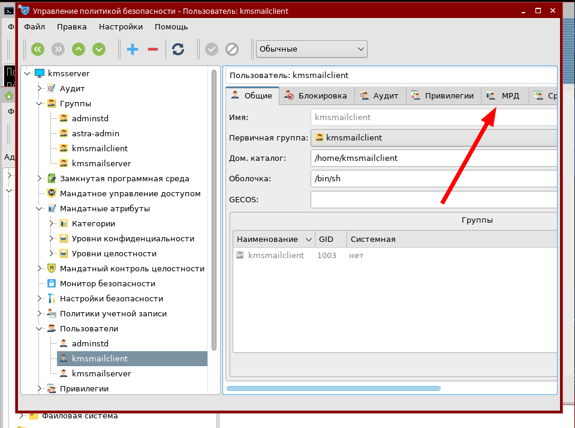
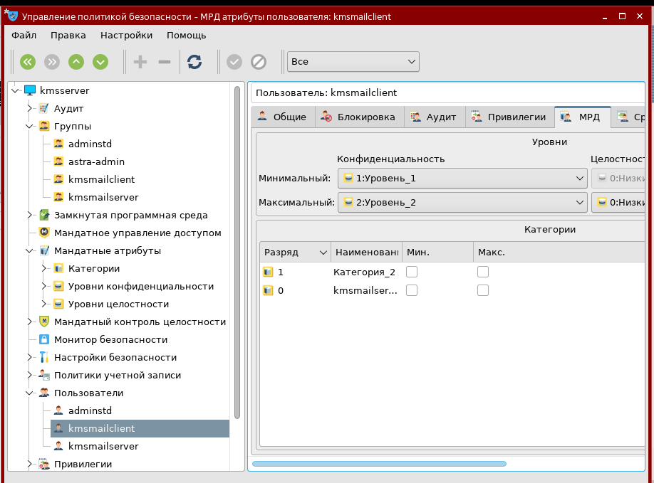
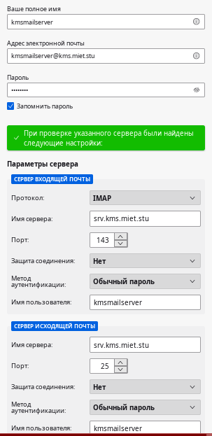

# Лабораторная работа №4 "Настройка почтового сервера"

## Задание 1 Произведите предварительные настройки

### Установите необходимые программы для работы почтового сервера. 

На сервере создайте двух пользователей, от имени которых будет происходить пересылка почтовых сообщений.

|                                | Пользователь 1 | Пользователь 2 |
|-                               |:-:             |:-:             |
|Имя:                            | kmsmailserver  | kmsmailclient  |
|Минимальный мандатный уровень:  | 1              | 1              |
|Максимальный мандатный уровень: | 2              | 2              |

Создаем пользователей на сервере

kmsmailserver@kmsserver:~$  `sudo apt-get install postfix dovecot-imapd astrase-fix-maildir`

kmsmailserver@kmsserver:~$ `sudo useradd -m kmsmailserver` (-m автоматом создаст хоумдир)

kmsmailserver@kmsserver:~$ `sudo useradd -m kmsmailclient`

kmsmailserver@kmsserver:~$ `sudo passwd kmsmailclient`

kmsmailserver@kmsserver:~$ `sudo passwd kmsmailserver`

Далее в панели управление ищем политики безопасности и делаем так





### От имени созданных пользователей создайте в их домашних директориях файл, в котором будет храниться их почта. Выдайте на созданную директорию права таким образом, чтобы работать с ней (чтение и запись) могли производить только сами пользователи.

adminstd@kmsserver ~ $ `su - kmsmailserver`

kmsmailserver@kmsserver:~$ `mkdir Mailbox`

kmsmailserver@kmsserver:~$ `chmod 700 Mailbox`

adminstd@kmsserver ~ $ `su - kmsmailclient`

kmsmailclient@kmsserver:~$ `mkdir Mailbox`

kmsmailclient@kmsserver:~$ `chmod 700 Mailbox`

## Задание 2 Настройте сервер и обменяйтесь сообщениями между сервером и клиентом

### Настройте сервер postfix. В параметрах укажите значения mynetworks для вышей сети, mydestination, в параметре home_mailbox укажите адрес созданных почтовых ящиков. После указанных параметров укажите значение smtpd_relay_restrictions (см. ниже). Без него письма будут блокированы. 

Комменнтим все остальное

adminstd@kmsserver ~ $ `sn /etc/postfix/main.cf`

```bash
mynetworks = 192.168.122.0/24
mydestination = $myhostname, localhost, kms.miet.stu
home_mailbox = ~/Mailbox/
smtpd_relay_restrictions = permit_mynetworks, permit_sasl_authenicated, reject_unauth_destination
```

После настройки перезагрузите службу

adminstd@kmsserver ~ $ `stl restart postfix`


### Настройте сервер dovecot в соответствии с указаниями выше. После настройки перезапустите службу.

Комментим всё остальное 

/etc/dovecot/conf.d/10-auth.conf
```bash
disable_plaintext_auth = no
auth_mechanisms = plain login
```

Комментим всё остальное 

adminstd@kmsserver ~ $ `sn /etc/dovecot/conf.d/10-mail.conf` 
```bash
mail_location = maildir:~/Mailbox/
```

adminstd@kmsserver ~ $ `stl restart dovecot`Ё


### На сервере откройте приложение Thunderbird, укажите в нем установленные параметры и создайте почтовый аккаунт.

adminstd@kmsserver ~ $ `thunderbird`



# И УБЕЖДАЕМСЯ ЧТО НИХУЯ НЕ РАБОТАЕТ

### На сервере откройте приложение Thunderbird, Укажите в нем установленные параметры и создайте почтовый аккаунт.

### Отправьте любое письмо с сервера на сервер.

### Запустите Thunderdird на машине клиента и зарегистрируйте клиента. Отправьте письмо с клиента на сервер и с сервера на клиент. 

## Задание 3

### Создайте почту yandex.ru и отправьте любое сообщение на неё от сервера и клиента

### Создайте пароль для доступа с локального сервера на созданную почту яндекс. Для этого переходим на сайт https://id.yandex.ru/, в раздел "Безопасность":