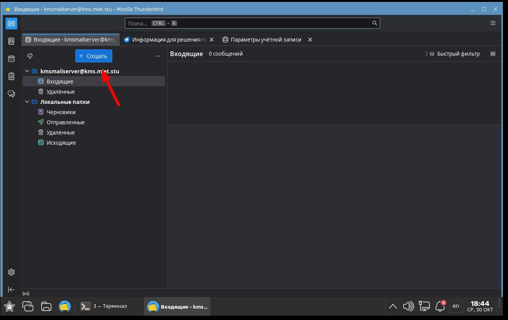
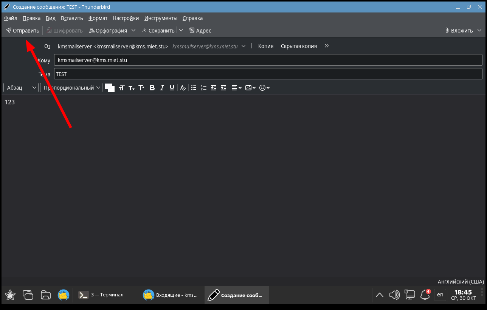
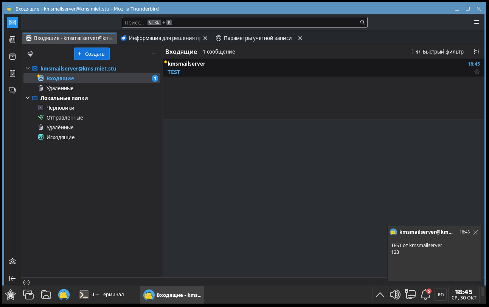
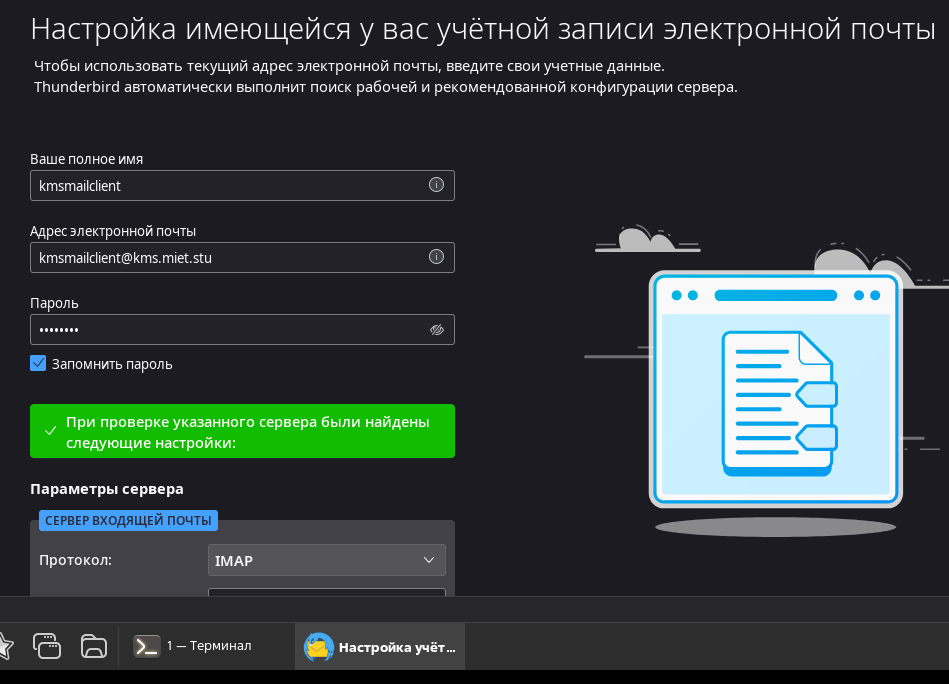
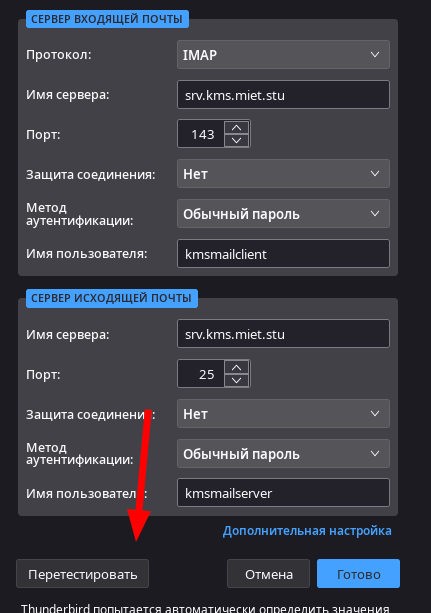
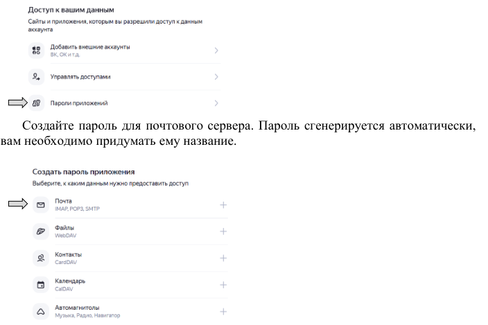
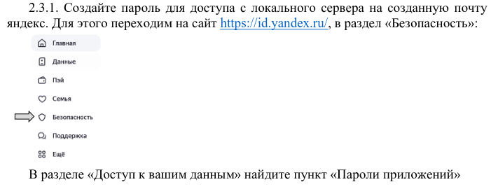
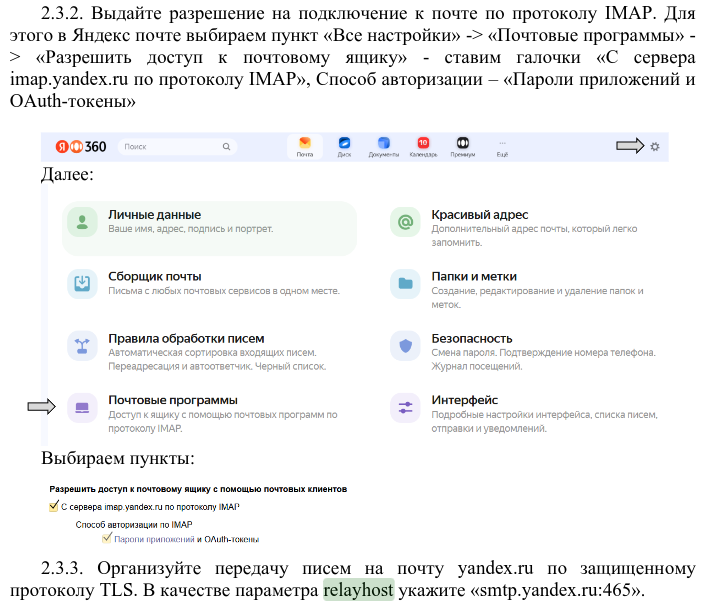

# Лабораторная работа №4 "Настройка почтового сервера"

## Задание 1 Произведите предварительные настройки

### Установите необходимые программы для работы почтового сервера. 

На сервере создайте двух пользователей, от имени которых будет происходить пересылка почтовых сообщений.

|                                | Пользователь 1 | Пользователь 2 |
|-                               |:-:             |:-:             |
|Имя:                            | kmsmailserver  | kmsmailclient  |

Создаем пользователей на сервере

kmsmailserver@kmsserver:~$  `sudo apt-get install postfix dovecot-imapd astrase-fix-maildir`

kmsmailserver@kmsserver:~$ `sudo useradd -m kmsmailserver` (-m автоматом создаст хоумдир)

kmsmailserver@kmsserver:~$ `sudo useradd -m kmsmailclient`

kmsmailserver@kmsserver:~$ `sudo passwd kmsmailclient`

kmsmailserver@kmsserver:~$ `sudo passwd kmsmailserver`

### От имени созданных пользователей создайте в их домашних директориях файл, в котором будет храниться их почта. Выдайте на созданную директорию права таким образом, чтобы работать с ней (чтение и запись) могли производить только сами пользователи.

adminstd@kmsserver ~ $ `su - kmsmailserver`

kmsmailserver@kmsserver:~$ `mkdir Mailbox`

kmsmailserver@kmsserver:~$ `chmod 700 Mailbox`

adminstd@kmsserver ~ $ `su - kmsmailclient`

kmsmailclient@kmsserver:~$ `mkdir Mailbox`

kmsmailclient@kmsserver:~$ `chmod 700 Mailbox`

## Задание 2 Настройте сервер и обменяйтесь сообщениями между сервером и клиентом

### Настройте сервер postfix. В параметрах укажите значения mynetworks для вышей сети, mydestination, в параметре home_mailbox укажите адрес созданных почтовых ящиков. После указанных параметров укажите значение smtpd_relay_restrictions (см. ниже). Без него письма будут блокированы. 

adminstd@kmsserver ~ $ `sn /etc/postfix/main.cf`

Комменнтим все остальное

```bash
mynetworks = 192.168.122.0/24
mydestination = $myhostname, localhost, kms.miet.stu
home_mailbox = Mailbox/
smtpd_relay_restrictions = permit_mynetworks, permit_sasl_authenicated, reject_unauth_destination
```

adminstd@kmsserver ~ $ `stl restart postfix`

### Настройте сервер dovecot в соответствии с указаниями выше. После настройки перезапустите службу.

adminstd@kmsserver ~ $ `sn /etc/dovecot/conf.d/10-auth.conf`

Следующие строки лучше не добавлять снизу, а менять уже существующие параметры, чтобы сохранить порядок (на самом деле не проверялось, влияет порядок или нет, но на всякий случай лучше его сохранить)

Далее комментим всё остальное кроме строки `!include auth-system.conf.ext`

```bash
disable_plaintext_auth = no
auth_mechanisms = plain login
```

Комментим всё остальное кроме

```bash
namespace inbox {
  ...
  inbox = yes
  ...
}
```

И как в прошлом случае, лучше не добавлять строку внизу, а изменить существующий параметр

adminstd@kmsserver ~ $ `sn /etc/dovecot/conf.d/10-mail.conf` 
```bash
mail_location = maildir:~/Mailbox/
```

adminstd@kmsserver ~ $ `stl restart dovecot`

### На сервере откройте приложение Thunderbird, укажите в нем установленные параметры и создайте почтовый аккаунт.

adminstd@kmsserver ~ $ `thunderbird`


Настроим сразу и на клиенте по горячим следам


Команды для отладки на всякий случай:

`sudo tail -f /var/log/mail.log`

`sudo systemctl status dovecot`

`sudo systemctl status postfix`

`sudo postfix check`

`sudo journalctl -f`

Вот еще одна команда, хз что она делает, вроде это специфика астры, но пусть будет тут (это уже не для отладки)

`sudo pdpl-user kmsmailserver -i 63`

### Отправьте любое письмо с сервера на сервер.

Вот тут я на новую версию астры перешел, поэтому скрины бутут чуть поприятнее







### Запустите Thunderbird на машине клиента и зарегистрируйте клиента. Отправьте письмо с клиента на сервер и с сервера на клиент. 





## Задание 3

### Создайте почту yandex.ru и отправьте любое сообщение на неё от сервера и клиента







В main.cf добавляем

adminstd@kmsserver ~ $ `sn /etc/postfix/main.cf`

```bash
smtp_use_tls = yes
smtp_sasl_auth_enable = yes
smtp_sasl_password_maps = hash:/etc/postfix/sasl_passwd
smtp_generic_maps = hash:/etc/postfix/generic
smtp_tls_CAfile = /etc/ssl/certs/Entrust_Root_Certification_Authority.pem
smtp_tls_session_cache_database = btree:/var/lib/postfix/smtp_tls_session_cache
smtp_tls_session_cache_timeout = 600s
smtp_tls_wrappermode = yes
smtp_sasl_security_options = noanonymous
smtp_tls_security_level = encrypt
smtp_tls_loglevel = 1

relayhost = smtp.yandex.ru:465
```

Создаем вот такие файлы

adminstd@kmsserver ~ $ `sn /etc/postfix/generic`

```bash
kmsmailserver@kms.miet.stu karpukhin235@yandex.ru
kmsmailclient@kms.miet.stu karpukhin235@yandex.ru
```

adminstd@kmsserver ~ $ `sn /etc/postfix/sasl_passwd`
```bash
smtp.yandex.ru karpukhin235@yandex.ru:rcobiickdswuqhlr
```

adminstd@kmsserver ~ $ `sudo postmap /etc/postfix/generic` 

adminstd@kmsserver ~ $ `sudo postmap /etc/postfix/sasl_passwd` 

## Контрольные вопросы (ChatGPT)

### 1. Для чего необходимы почтовые сервера?
Почтовые серверы необходимы для отправки, получения и хранения электронной почты. Они обеспечивают обмен сообщениями между пользователями и другими серверами, управляют очередями сообщений и обеспечивают защиту и хранение данных. Основные типы почтовых серверов включают:
- **SMTP-серверы** — для отправки почты.
- **POP3/IMAP-серверы** — для получения почты.

### 2. Как происходит процесс передачи почты?
Процесс передачи почты включает следующие этапы:
1. Пользователь создает сообщение в почтовом клиенте.
2. Клиент отправляет сообщение на SMTP-сервер, который отвечает за отправку почты.
3. SMTP-сервер проверяет адрес получателя и определяет, какой сервер (MX-сервер) должен получить сообщение.
4. Сообщение передается от SMTP-сервера к MX-серверу получателя через Интернет.
5. После получения почты MX-сервер помещает ее в почтовый ящик получателя.
6. Получатель может получить сообщение через почтовый клиент, используя IMAP или POP3.

### 3. Для чего необходим компонент MDA?
MDA (Mail Delivery Agent) отвечает за доставку электронной почты в почтовые ящики пользователей на сервере. Он принимает сообщения от MTA (Mail Transfer Agent, то есть SMTP-сервера) и размещает их в соответствующих почтовых ящиках, что позволяет пользователям затем получить доступ к своим сообщениям.

### 4. Как работает протокол SMTP?
Протокол SMTP (Simple Mail Transfer Protocol) работает по принципу клиент-сервер. Основные этапы работы:
1. Клиент подключается к SMTP-серверу.
2. Клиент отправляет команды, такие как:
   - `HELO` (или `EHLO`)
   - `MAIL FROM` (от кого)
   - `RCPT TO` (кому)
   - `DATA` (содержимое сообщения)
3. Сервер обрабатывает команды и подтверждает их.
4. Если адрес получателя действителен, сервер отправляет сообщение дальше или сохраняет его для дальнейшей отправки.
5. Сервер закрывает соединение, когда все сообщения отправлены.

### 5. В чем отличие протоколов IMAP и POP3?
IMAP (Internet Message Access Protocol) и POP3 (Post Office Protocol 3) — это протоколы для получения электронной почты, но они работают по-разному:
- **IMAP**: Позволяет пользователям работать с сообщениями на сервере. Все сообщения остаются на сервере, и пользователи могут организовывать их в папки, отмечать прочитанными и т. д. IMAP поддерживает синхронизацию, что позволяет доступ к одной и той же почте с разных устройств.
- **POP3**: Загружает сообщения с сервера на устройство пользователя и обычно удаляет их с сервера. Это означает, что после загрузки почты на одном устройстве, доступ к этим сообщениям с других устройств может быть невозможен, если не настроено иное.

Эти протоколы выбираются в зависимости от потребностей пользователя в доступе к электронной почте.
