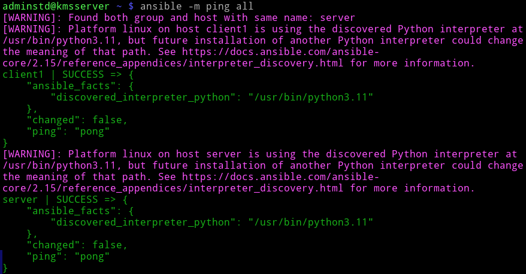
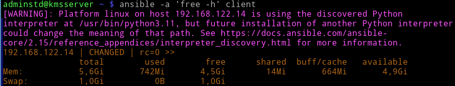

# Лабораторная работа №4 "Управление конфигурациями хостов с помощью Ansible"

## Настройте ansible на серверной машине. В качестве клиентов выберите обе машины - сервер и клиент.

adminstd@kmsserver ~ $ `sudo apt install ansible`

Если ssh не настроен, то надо его настроить, так как ansible работает через ssh, только есть нюанс. Ключи нужно прокинуть еще с сервера на сервер и с клиента на клиент. Звучит тупо, но да, это нужно, поскольку дальше ansible на сервере будет подключаться по ssh к этому же серверу.

Настраиваем файл инвентаризации (список устройств с которыми будет вестись работа)

adminstd@kmsserver ~ $ `sudo mkdir /etc/ansible`

adminstd@kmsserver ~ $ `sudo touch /etc/ansible/hosts`

adminstd@kmsserver ~ $ `sn /etc/ansible/hosts` 

Тут можно указывать айпишники, но мне лень их вспоминать, поэтому я напишу имена, как у меня в dns сервере

```bash
[clients]
client1 
[server]
server  
```

## Проверьте доступность всех устройств с помощью команды ping используя запуск скриата ansible

adminstd@kmsserver ~ $ `ansible -m ping all`



## Используя ansible, запустите на машине клиента скрипт, выводящий объем свободной оперативной машины

adminstd@kmsserver ~ $ ansible -a 'free -h' client



## Создайте playbook, выполняющий следующие задания:

adminstd@kmsserver ~ $ sudo touch /etc/ansible/myplaybook.yml

### Создайте директории Serverkms на сервере и Clientkms на машине клиента соответвтвенно. Данные директории создаются в домашней директории пользователя.

### Создайте файлы с названием info в домашней директории. Добавьте проверку на существование файла. В случае его наличия файл повторно не создается.

adminstd@kmsserver ~ $ sn -l /etc/ansible/myplaybook.yml 

```bash
- name: Create dirs and files
  hosts:
   - server
   - client
  become: no
  tasks:

   - name: Create dir on server
     file:
       path: ~/Serverkms
       state: directory
     when: inventory_hostname == 'server'

   - name: Create dir on client
     file:
       path: ~/Clientkms
       state: directory
     when: inventory_hostname == 'client'

   - name: Checking if the file exists on server
     stat:
       path: ~/info
     when: inventory_hostname == 'server'
     register: srv_file_check

   - name: Checking if the file exists on client
     stat:
       path: ~/info
     when: inventory_hostname == 'client'
     register: cli_file_check

   - name: Create info in server
     file:
       path: ~/info
       state: touch
     when: inventory_hostname == 'server' and srv_file_check.stat.exists == false

   - name: Create info in client
     file:
       path: ~/info
       state: touch
     when: inventory_hostname == 'client' and cli_file_check.stat.exists == false

  
  ansible_memory_mb.nocache.used
```

adminstd@kmsserver ~ $ ansible-playbook /etc/ansible/myplaybook.yml

### Заполните данные файлы информацией о системе, влкючающей в себя имя машины, вашу фамилию, ip адрес, объём занятой оперативной памяти (в Mb), среднюю нагрузку за последние 15 минут работы (см. файл /proc/loadavg). Формат записи: astra001 | Karpukhin | 192.168.122.1 | 722 | 1.58

### Скопируйте данный файл в созданную в п. 1.1 директорию.

### Измените в перемещенном файле значение вашей фамилии на ваше имя.

### В зависимости от значения нагрузки в файле выведите сообщение на экран. Если нагрузка больше 1: state NAME_MACHINE bad. Если меньше 1, то state NAME_MACHINE good.


## Контрольные вопросы:

### 1. Какая команда используется для проигрывания сценариев?

### 2. Как называется ключ в play, в котором указываются хосты для выполнения заданий (task)?

### 1. Что нужно сделать для того, чтобы задания в сценарии выполнялись с привилегиями администратора?