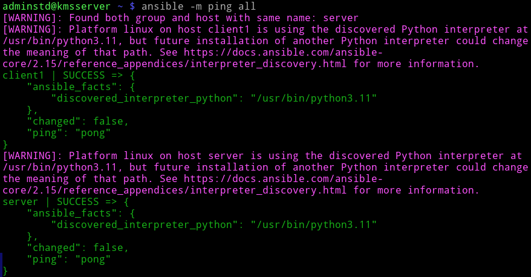
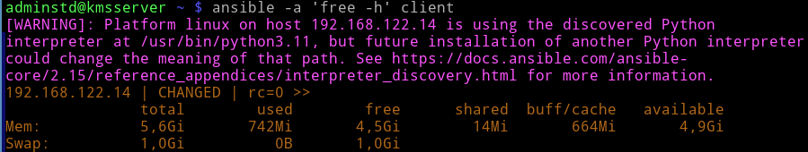

# Лабораторная работа №5 "Управление конфигурациями хостов с помощью Ansible"

## Настройте ansible на серверной машине. В качестве клиентов выберите обе машины - сервер и клиент.

adminstd@kmsserver ~ $ `sudo apt install ansible`

Если ssh не настроен, то надо его настроить, так как ansible работает через ssh, только есть нюанс. Ключи нужно прокинуть еще с сервера на сервер и с клиента на клиент. Звучит тупо, но да, это нужно, поскольку дальше ansible на сервере будет подключаться по ssh к этому же серверу.

Настраиваем файл инвентаризации (список устройств с которыми будет вестись работа)

adminstd@kmsserver ~ $ `sudo mkdir /etc/ansible`

adminstd@kmsserver ~ $ `sudo touch /etc/ansible/hosts`

adminstd@kmsserver ~ $ `sn /etc/ansible/hosts` 

Тут можно указывать айпишники, но мне лень их вспоминать, поэтому я напишу имена, как у меня в dns сервере

```bash
[clients]
client1 
[servers]
server  
```

## Проверьте доступность всех устройств с помощью команды ping используя запуск скриата ansible

adminstd@kmsserver ~ $ `ansible -m ping all`



## Используя ansible, запустите на машине клиента скрипт, выводящий объем свободной оперативной машины

adminstd@kmsserver ~ $ `ansible -a 'free -h' client`



## Создайте playbook, выполняющий следующие задания:

adminstd@kmsserver ~ $ `sudo touch /etc/ansible/myplaybook.yml`

### Создайте директории Serverkms на сервере и Clientkms на машине клиента соответвтвенно. Данные директории создаются в домашней директории пользователя.

### Создайте файлы с названием info в домашней директории. Добавьте проверку на существование файла. В случае его наличия файл повторно не создается.

adminstd@kmsserver ~ $ `sn -l /etc/ansible/create.yml`

```bash
- name: Create dirs and files
  hosts:
    - server
    - client1
  become: no
  tasks:

    - name: Create dir on server
      file:
        path: "{{ ansible_env.HOME }}/Serverkms"
        state: directory
      when: inventory_hostname == 'server'

    - name: Create dir on client
      file:
        path: "{{ ansible_env.HOME }}/Clientkms"
        state: directory
      when: inventory_hostname == 'client1'

    - name: Checking if the file exists on server
      stat:
        path: "{{ ansible_env.HOME }}/info"
      when: inventory_hostname == 'server'
      register: srv_file_check

    - name: Checking if the file exists on client
      stat:
        path: "{{ ansible_env.HOME }}/info"
      when: inventory_hostname == 'client1'
      register: cli_file_check

    - name: Create info in server
      file:
        path: "{{ ansible_env.HOME }}/info"
        state: touch
      when: inventory_hostname == 'server' and srv_file_check.stat.exists == false

    - name: Create info in client
      file:
        path: "{{ ansible_env.HOME }}/info"
        state: touch
      when: inventory_hostname == 'client1' and cli_file_check.stat.exists == false
```
  ansible_memory_mb.nocache.used

adminstd@kmsserver ~ $ `ansible-playbook /etc/ansible/create.yml`

### Заполните данные файлы информацией о системе, влключающей в себя имя машины, вашу фамилию, ip адрес, объём занятой оперативной памяти (в Mb), среднюю нагрузку за последние 15 минут работы (см. файл /proc/loadavg). Формат записи: имя машины | Karpukhin | ip адрес | объем занятой оперативной памяти | нагрузка за последние 15 минут работы

### Скопируйте данный файл в созданную в п. 1.1 директорию.

### Измените в перемещенном файле значение вашей фамилии на ваше имя.

### В зависимости от значения нагрузки в файле выведите сообщение на экран. Если нагрузка больше 1: state NAME_MACHINE bad. Если меньше 1, то state NAME_MACHINE good.

adminstd@kmsserver ~ $ `sn /etc/ansible/fill.yml` 

```bash
- name: Gather system information and write to file
  hosts: all
  gather_facts: true
  tasks:
    - name: Get machine's IP address
      ansible.builtin.command: hostname -I
      register: ip_address
      changed_when: false

    - name: Get memory usage in MB
      ansible.builtin.shell: "free -m | awk '/Mem:/ {print $3}'"
      register: memory_usage
      changed_when: false

    - name: Get load average (15 min)
      ansible.builtin.shell: "awk '{print $3}' /proc/loadavg"
      register: load_average
      changed_when: false

    - name: Write system information to info file in home directory
      ansible.builtin.lineinfile:
        path: "{{ ansible_env.HOME }}/info"
        create: true
        line: "{{ ansible_hostname }} | Karpukhin | {{ ip_address.stdout.strip() }} | {{ memory_usage.stdout.strip() }} | {{ load_average.stdout.strip() }}"
      become: true

    - name: Create serverkms or clientkms directory if not exists
      ansible.builtin.file:
        path: "{{ ansible_env.HOME }}/{{ 'Clientkms' if inventory_hostname == 'client1' else 'Serverkms' }}"
        state: directory
      become: true

    - name: Debug - check target directory
      ansible.builtin.debug:
        msg: "Target directory: {{ ansible_env.HOME }}/{{ 'Clientkms' if inventory_hostname == 'client1' else 'Serverkms' }}"

    - name: Move info file to serverkms or clientkms directory
      ansible.builtin.command: >
        mv "{{ ansible_env.HOME }}/info" "{{ ansible_env.HOME }}/{{ 'Clientkms' if inventory_hostname == 'client1' else 'Serverkms' }}/info"
      become: true

    - name: Replace 'Karpukhin' with 'Maxim' in the info file
      ansible.builtin.replace:
        path: "{{ ansible_env.HOME }}/{{ 'Clientkms' if inventory_hostname == 'client1' else 'Serverkms' }}/info"
        regexp: 'Karpukhin'
        replace: 'Maxim'
      become: true
```

## Контрольные вопросы:

### 1. Какая команда используется для проигрывания сценариев?
Команда для проигрывания сценариев в Ansible — `ansible-playbook`.

### 2. Как называется ключ в play, в котором указываются хосты для выполнения заданий (task)?
Ключ, в котором указываются хосты для выполнения заданий, называется `hosts`.

### 3. Что нужно сделать для того, чтобы задания в сценарии выполнялись с привилегиями администратора?
Чтобы задания в сценарии выполнялись с привилегиями администратора, необходимо использовать ключ `become`. В playbook это можно указать следующим образом:

```yaml
become: true
```