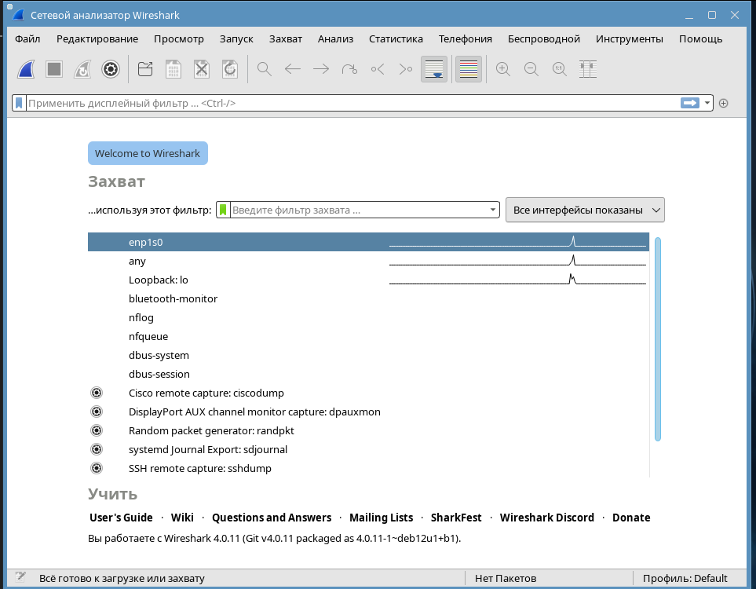
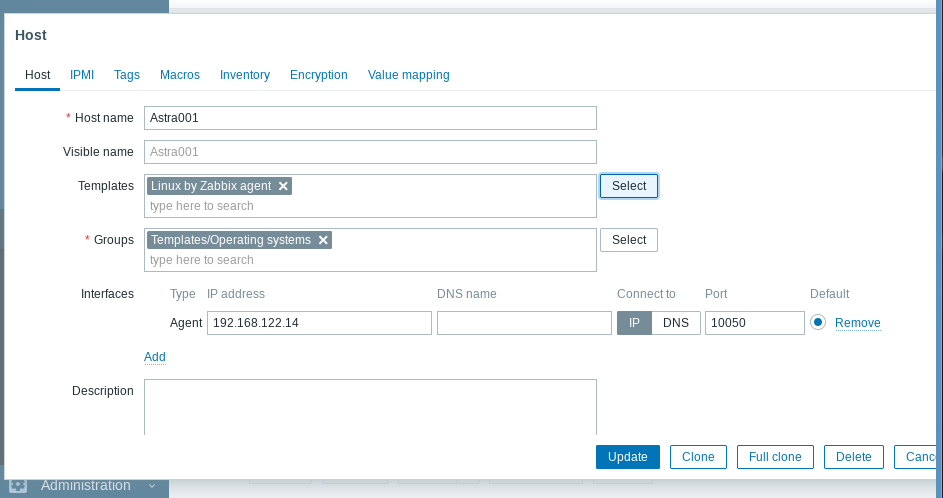
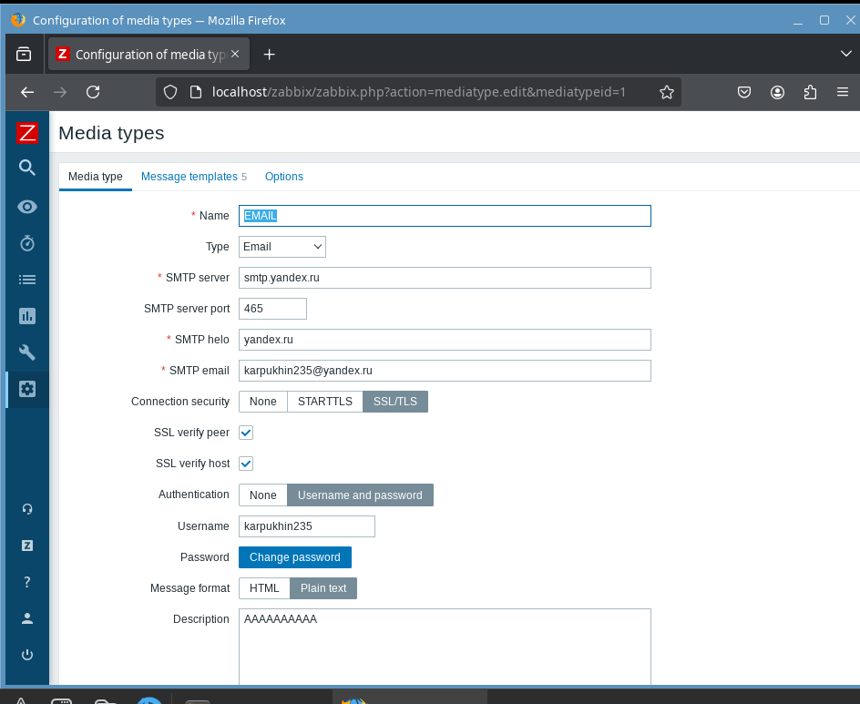
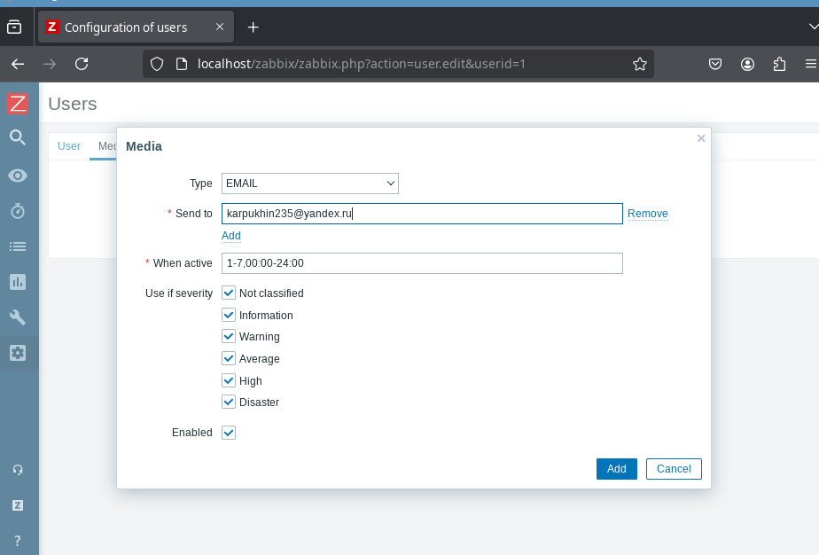

# Лабораторная работа №7 "Мониторинг сети с помощью программ Zabbix и Wireshark"

## Wireshark

### Запустите программу wireshark на сервере

adminstd@kmsserver ~ $ `sudo apt install wireshark`

adminstd@kmsserver ~ $ `sudo wireshark`

### Установите фильтр, выбрав ip-адреса клиента, сервера и сетевого моста.



`ip.addr == 192.168.122.14 || ip.addr == 192.168.122.13`

### Выполните следующие команды и проанализируйте результат их работы в wireshark:

#### ping с сервера на клиент

Команда ping 192.168.122.14 отправляет ICMP Echo Request с сервера на клиент. Клиент должен ответить ICMP Echo Reply.

#### ping на адрес, расположенный вне сети

adminstd@kmsserver ~ $ `ping 111.111.111.111`

При ping на IP-адрес, который не существует или недоступен, Echo Request отправляется, но Echo Reply не возвращается.

#### ping с клиента на сервер по доменному имени сервера

adminstd@kmsclient ~ $ `ping server`

Команда `ping server` использует DNS для определения IP-адреса сервера. Сначала идёт 2 запроса на днс сервер по протоколу DNS, потом возвращается 2 ответа (тоже по DNS). Далее идёт стандартный опрос как в предыдущих случаях по протоколу ICMP


#### ping с клиента на сервер по доменному имени сервера, не включенного в список DNS

Если доменное имя не зарегистрировано в DNS, то команда `ping` завершится ошибкой.

#### открытие веб-страницы из предыдущей лабораторной работы на клиенте

Сначала мы увидем DNS запрос и ответ

Потом установку TCP соединения

- TCP SYN — начало установления соединения
- TCP SYN-ACK — подтверждение от сервера
- TCP ACK — завершение трехстороннего рукопожатия

Потом HTTP запрос и ответ

Потом закрытие TCP соединения

- TCP FIN — начало закрытия соединения
- TCP ACK — подтверждение завершения соединения


#### обновление адреса DHCP на клиенте с помощью команд sudo dhclient -r; sudo dhclient

Сначала освобождается текущий IP-адрес (с помощью -r, который выполняет DHCP RELEASE), а затем запрашивает новый IP-адрес с помощью протокола DHCP

#### обмен TCP сообщениями между клиентом и сервером (запуск файлов tcpserver.py, tcpclient.py, исходные коды в приложении)

adminstd@kmsclient ~ $ `sn tcpclient.py`

```bash
import socket
HOST = "127.0.0.1"
PORT = 65432
bufferSize = 1024
TCPClientSocket=socket.socket(socket.AF_INET, socket.SOCK_STREAM)
TCPClientSocket.connect((HOST, PORT))
TCPClientSocket.sendall(b"Hello, world")
data = TCPClientSocket.recv(bufferSize)
print(f"Received {data!r}")
```

adminstd@kmsserver ~ $ sn tcpserver.py

```bash
import socket
HOST = "127.0.0.1"
PORT = 65432
bufferSize = 1024
TCPServerSocket=socket.socket(socket.AF_INET, socket.SOCK_STREAM)
TCPServerSocket.bind((HOST, PORT))
TCPServerSocket.listen()
TCPAnswer=TCPServerSocket.accept()
connection = TCPAnswer[0]
address = TCPAnswer[1]
print(f"Connected by {address}")
data = connection.recv(bufferSize)
connection.sendall(data)
```

TCP:

Трехстороннее рукопожатие (SYN, SYN-ACK, ACK):

Клиент и сервер обмениваются пакетами для установления TCP-соединения.
Передача данных:

Пакеты с данными ("Hello, world") передаются от клиента к серверу и обратно.
В Wireshark будут видны пакеты с данными.
Закрытие соединения (FIN, ACK):

Клиент и сервер отправляют пакеты FIN для завершения соединения.

#### обмен UDP сообщениями между клиентом и сервером (запуск файлов udpserver.py, udpclient.py, исходные коды в приложении)

adminstd@kmsclient ~ $ sn udpclient.py

```bash
import socket
msgFromServer = "Hello world!"
bytesToSend = str.encode(msgFromServer)
serverAddressPort = ("127.0.0.1", 65432)
bufferSize = 1024
UDPClientSocket=socket.socket(socket.AF_INET, socket.SOCK_DGRAM)
UDPClientSocket.sendto(bytesToSend, serverAddressPort)
data = UDPClientSocket.recv(bufferSize)
print(f"Received {data!r}")
```

adminstd@kmsserver ~ $ sn udpserver.py

```bash
import socket
HOST = "127.0.0.1"
PORT = 65432
bufferSize = 1024
UDPServerSocket=socket.socket(socket.AF_INET, socket.SOCK_DGRAM)
UDPServerSocket.bind((HOST, PORT))
UDPAnswer=UDPServerSocket.recvfrom(bufferSize)
connection = UDPAnswer[0]
address = UDPAnswer[1]
print(f"Connected by {address}")
UDPServerSocket.sendto(connection,address)
```

UDP:
Отправка и получение пакетов:
В Wireshark будут видны UDP-пакеты, содержащие данные, передаваемые от клиента к серверу и обратно.
Никакого рукопожатия или завершения соединения:
В отличие от TCP, UDP не требует установления и завершения соединения, поэтому вы не увидите процессов рукопожатия или закрытия.

## Zabbix

### Установите и настройте систему мониторинга Zabbix

adminstd@kmsserver ~ $ `sudo apt install zabbix-server-pgsql zabbix-frontend-php php-pgsql`

Перед началом работы необходимо назначить метки безопасности 
служебным пользователям postgres и zabbix:

adminstd@kmsserver ~ $ `sudo pdpl-user -i 63 postgres`

```bash
минимальная метка: Уровень_0:Низкий:Нет:0x0
   0:0:0x0:0x0
максимальная метка: Уровень_0:63:Нет:0x0
   0:63:0x0:0x0
adminstd@kmsserver ~ $ sudo pdpl-user -l 0:0 zabbix
минимальная метка: Уровень_0:Низкий:Нет:0x0
   0:0:0x0:0x0
максимальная метка: Уровень_0:Низкий:Нет:0x0
   0:0:0x0:0x0
adminstd@kmsserver ~ $ sudo usermod -a -G shadow postgres
```

Предоставить служебному пользователю postgres право чтения базы данных меток 
безопасности локальных пользователей:

adminstd@kmsserver ~ $ `sudo setfacl -d -m u:postgres:r /etc/parsec/{macdb,capdb}`

adminstd@kmsserver ~ $ `sudo setfacl -R -m u:postgres:r /etc/parsec/{macdb,capdb}`

adminstd@kmsserver ~ $ `sudo setfacl -m u:postgres:rx /etc/parsec/{macdb,capdb}`


**Настройка apache2**

В файле /etc/php/*/apache2/php.ini раскоментировать и дописать 

adminstd@kmsserver ~ $ `sn /etc/php/8.2/apache2/php.ini` 

```bash
[Date]
date.timezone = Europe/Moscow
```


В файле /etc/apache2/apache2.conf расскомментить и установить “AstraMode off”

adminstd@kmsserver ~ $ `sn /etc/apache2/apache2.conf`

Этими действиями мы установили часовой пояс на веб сервере и отключили astra 
security mode

Необходимо проверить, что DNS работает корректно и производиться 
преобразование доменных имен в IP адреса

**Настройка СУБД PostgreSQL**

adminstd@kmsserver ~ $ `sn /etc/postgresql/15/main/pg_hba.conf` 

```bash
# TYPE DATABASE USER ADDRESS METHOD
local zabbix zabbix trust
# IPv4 local connections:
host zabbix zabbix 127.0.0.1/32 trust
```

adminstd@kmsserver ~ $ `sudo systemctl restart postgresql`

adminstd@kmsserver ~ $ `sudo systemctl status postgresql`

**Создать пользователя и базу zabbix**

adminstd@kmsserver ~ $ `sudo -u postgres psql`

```bash
could not change directory to "/home/adminstd": Отказано в доступе
psql (15.6 (Debian 15.6-astra.se2+b1))
Type "help" for help.

postgres=# CREATE DATABASE ZABBIX;
postgres=# CREATE USER zabbix WITH ENCRYPTED PASSWORD '12345678';
postgres=# GRANT ALL ON DATABASE zabbix to zabbix;
postgres=# ALTER DATABASE zabbix OWNER TO zabbix;
```

Далее копируется шаблон базы данных

adminstd@kmsserver ~ $ `sudo zcat /usr/share/zabbix-server-pgsql/{schema,images,data}.sql.gz | psql -h localhost zabbix zabbix`

adminstd@kmsserver ~ $ `sudo a2enconf zabbix-frontend-phpConf zabbix-frontend-php` 

adminstd@kmsserver ~ $ `sudo systemctl restart apache2`

**Настройка веб интерфейса**

adminstd@kmsserver ~ $ `sudo cp /usr/share/zabbix/conf/zabbix.conf.php.example /etc/zabbix/zabbix.conf.php`

Установить права доступа к созданному файлу:

adminstd@kmsserver ~ $ `sudo chown www-data:www-data /etc/zabbix/zabbix.conf.php`

В файле /etc/zabbix/zabbix.conf.php задать значения переменных TYPE (тип
используемой СУБД) и PASSWORD (пароль пользователя zabbix СУБД):

adminstd@kmsserver ~ $ `sn /etc/zabbix/zabbix.conf.php`

```bash
$DB['TYPE']                             = 'POSTGRESQL';
$DB['SERVER']                   = 'localhost';
$DB['PORT']                             = '0';
$DB['DATABASE']                 = 'zabbix';
$DB['USER']                             = 'zabbix';
$DB['PASSWORD']                 = '12345678';
```

adminstd@kmsserver ~ $ `sudo systemctl reload apache2`

В конфигурационном файле /etc/zabbix/zabbix_server.conf раскомментировать 
строку, задающую пароль доступа к БД zabbix, и указать там пароль:

adminstd@kmsserver ~ $ `sn /etc/zabbix/zabbix_server.conf`

```bash
DBPassword=12345678
```

adminstd@kmsserver ~ $ `sudo systemctl enable zabbix-server`

adminstd@kmsserver ~ $ `sudo systemctl start zabbix-server`

adminstd@kmsserver ~ $ `sudo systemctl status zabbix-server`

Проверка

adminstd@kmsclient ~ $ `sudo zabbix_agentd -t -c /etc/zabbix/zabbix_agentd.conf`


**Настройка locale**

В файле /etc/locale.gen раскомментировать строку en_US.UTF-8. Выполнить
locale-gen. Открыть WEB-страницу zabbix в WEB-браузере. Имя для входа: Admin
(с заглавной буквы), пароль для входа: zabbix

adminstd@kmsserver ~ $ `sn /etc/locale.gen`

```bash
ru_RU.UTF-8 UTF-8
en_US.UTF-8 UTF-8
```

adminstd@kmsserver ~ $ `sudo locale-gen`

adminstd@kmsserver ~ $ `firefox localhost/zabbix`

**Настройка Zabbix-agent**

Устанавливаем на клиенте службу

adminstd@kmsclient ~ $ `sudo apt install zabbix-agent`

В конфигурационном файле `/etc/zabbix/zabbix_agentd.conf` меняем ip сервера на 
актуальный(который меняли в `/etc/hosts`), имя хоста устанавливаем как имя 
клиента(я укажу Astra001).

adminstd@kmsclient ~ $ `sn /etc/zabbix/zabbix_agentd.conf`

```bash
Server=192.168.122.13
...
Hostname=Astra001
```

adminstd@kmsclient ~ $ `sudo systemctl restart zabbix-agent`

**Добавление хоста и метрик**

Для добавления хоста перейдем во вкладку Configuration>host. В правом верхнем 
углу нажмем create host



Имя хоста должно совпадать с тем, которое задали на клиенте(агенте), и добавляем 
ip адрес агента. Если все выполнено правильно zbx значок в столбце Availability
станет зеленым через какое-то время

В случае ошибки нужно проверить конфигурацию хостов и перезапускать apache2 
на сервере.

**Настройка сообщений о ключевых событиях**


### Добавьте мониторинг следующих параметров: Нагрузка CPU, объем свободной/занятой оперативной памяти, объем свободной/занятой памяти жесткого диска
### Отобразите выбранные параметры в виде графиков

Monitor>Dashbord>Edit dasboard

### Добавьте триггер, срабатывающий в случае перезагрузки клиентской машины, отключения сетевого интерфейса, перегрузки процессора

Configuration>Actions>Triger actions

### Настройте всплывающие уведомления

User settings>Profile>messaging Ставим галку Frontend messaging

### Настройте отправку уведомлений на вашу электронную почту


Необходимо зарегистрировать почту с которой будет писать заббикс сервер и 
добавить ее в Administrations>Media types (на примере Mail.ru, также необходимо 
получить пароль от почты для внешних приложений)

Нужно добавить почту в Administration>Media types



Нажать test справа для проверки

Далее необходимо добавить почту пользователю admin(Administrations>Users)



### Опционально: настройте отправку уведомлений в телеграмм/discord

